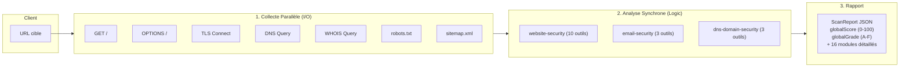

# Architecture du dossier `lib/` — Collectors & Outils de Scan

## Vue d'ensemble

Le dossier [lib/](file:///c:/Users/user/Desktop/Stage/clarveon-export/lib) est le **cœur du moteur de scan de sécurité** du projet Clarveon. Il suit une architecture en **pipeline à 3 couches** stricte et modulaire, basée sur le pattern **Collect → Analyze → Report** :

```mermaid
graph TD
    SE["🎯 ScanEngine<br/>(Chef d'orchestre)"]
    
    subgraph Collectors["📡 Phase 1 : Collecteurs (Données Brutes Réseau)"]
        HC["HttpCollector"]
        TC["TlsCollector"]
        DC["DnsCollector"]
        WC["WhoisCollector"]
    end
    
    subgraph Tools["🔍 Phase 2 : Outils d'Analyse (Logique Pure)"]
        subgraph WebSec["🌐 website-security/"]
            SSL["SslChecker"]
            TLS["TlsAnalyzer"]
            HDR["SecurityHeadersChecker"]
            CK["CookieAnalyzer"]
            MTH["HttpMethodsAnalyzer"]
            CRS["CorsAnalyzer"]
            CSP["CspValidator"]
            RDT["RedirectAnalyzer"]
            RBT["RobotsAnalyzer"]
            STM["SitemapChecker"]
        end
        
        subgraph EmailSec["✉️ email-security/"]
            SPF["SpfChecker"]
            DKM["DkimChecker"]
            DMC["DmarcChecker"]
        end
        
        subgraph DnsDomainSec["🔑 dns-domain-security/"]
            DNS["DnsLookup"]
            WHO["WhoisLookup"]
            AGE["DomainAgeChecker"]
        end
    end
    
    SE -->|"1. Collecte parallèle (Promise.all)"| Collectors
    SE -->|"2. Distribution synchrone"| Tools
    
    HC -->|HttpCollectionResult| HDR & CK & CSP & RDT & RBT & STM
    HC -->|HttpResponseData| MTH & CRS
    TC -->|TlsCollectionResult| SSL & TLS
    DC -->|DnsCollectionResult| SPF & DKM & DMC & DNS
    WC -->|WhoisCollectionResult| WHO & AGE
```

---

## 1. Le ScanEngine — Le chef d'orchestre

📄 [scanEngine.ts](file:///c:/Users/user/Desktop/Stage/clarveon-export/lib/scanEngine.ts)

Le `ScanEngine` **n'effectue aucune analyse lui-même**. Son rôle est strictement d'orchestrer le workflow de scan :

1. **Normalisation de l'URL** — Ajout du schéma `https://` si absent, extraction du nom de domaine (hostname) et de l'origine.
2. **Phase de Collecte** — Lancement de **7 requêtes réseau en parallèle** via `Promise.all()` :
   - `HttpCollector.collectGet(url)` — Requête GET principale
   - `HttpCollector.collectOptions(url)` — Requête OPTIONS (CORS / méthodes autorisées)
   - `TlsCollector.collect(domain)` — Connexion TLS socket brute
   - `DnsCollector.collect(domain)` — Résolution d'enregistrements DNS
   - `WhoisCollector.collect(domain)` — Requête d'enregistrement WHOIS
   - `HttpCollector.collectGet(origin/robots.txt)` — Récupération du `robots.txt`
   - `HttpCollector.collectGet(origin/sitemap.xml)` — Récupération du `sitemap.xml`
3. **Phase d'Analyse** — Distribution des données brutes aux **16 outils d'analyse** (exécution synchrone, 0 requête réseau).
4. **Agrégation & Rapport** — Calcul d'un **score global** (moyenne des scores sur 100) et conversion en **grade lettre** (`A`/`B`/`C`/`D`/`F`).

> [!IMPORTANT]
> **Règle fondamentale d'architecture :**
> - Les **collecteurs** réalisent **100% des appels réseau** et aucune analyse.
> - Les **outils d'analyse** réalisent **0 appel réseau** et 100% de la logique d'évaluation de sécurité.

---

## 2. Les Collectors — Récupération des données brutes (`lib/collectors/`)

### 📄 [HttpCollector](file:///c:/Users/user/Desktop/Stage/clarveon-export/lib/collectors/http.ts)

Classe statique qui effectue les **requêtes HTTP/HTTPS pures** et retourne les données brutes sans interprétation.

| Méthode | Rôle | Retour |
|---|---|---|
| `collectGet()` | Requête GET avec **suivi manuel des redirections** | `HttpCollectionResult` |
| `collectOptions()` | Requête OPTIONS pour CORS/méthodes autorisées | `HttpResponseData \| null` |

**Points techniques importants :**
- **Redirections manuelles** (`redirect: 'manual'`) : Chaque saut (301, 302…) est conservé dans `redirectChain[]` pour valider le comportement HTTP→HTTPS et la persistance des cookies.
- **User-Agent personnalisé** : `Clarveon-Security-Analyzer/1.0`
- **Timeout avec AbortController** pour éviter les connexions pendantes.
- **Headers normalisés en minuscules** via `parseHeaders()`.

---

### 📄 [TlsCollector](file:///c:/Users/user/Desktop/Stage/clarveon-export/lib/collectors/tls.ts)

Classe statique qui ouvre une **connexion TLS socket bas-niveau** (module Node.js `tls`) pour extraire les informations du certificat et du protocole négocié.

| Donnée récoltée | Source |
|---|---|
| Protocole négocié (TLSv1.2, TLSv1.3…) | `socket.getProtocol()` |
| Suite de chiffrement / Cipher | `socket.getCipher()` |
| Certificat complet (subject, issuer, dates, SANs, etc.) | `socket.getPeerCertificate()` |
| Statut d'autorisation (CA reconnue ?) | `socket.authorized` |

**Point technique clé :** `rejectUnauthorized: false` est configuré afin de pouvoir capturer et analyser les certificats expirés, invalides ou auto-signés sans provoquer une interruption de connexion.

---

### 📄 [DnsCollector](file:///c:/Users/user/Desktop/Stage/clarveon-export/lib/collectors/dns.ts)

Classe statique qui interroge les serveurs DNS de façon asynchrone (`dns/promises`).

| Enregistrements récoltés | Cibles / Domaines |
|---|---|
| `A` / `AAAA` | Adresse IPv4 et IPv6 |
| `MX` | Serveurs de messagerie (exchanges, priorités) |
| `TXT` | Enregistrements TXT du domaine, de `_dmarc.<domain>`, et des sélecteurs DKIM courants (`default`, `google`, `selector1`, `k1`…) |
| `NS` | Serveurs de noms du domaine |
| `CAA` | Autorités de certification autorisées (Certification Authority Authorization) |

---

### 📄 [WhoisCollector](file:///c:/Users/user/Desktop/Stage/clarveon-export/lib/collectors/whois.ts)

Classe statique qui effectue une requête WHOIS (`whois-json`) pour extraire les informations administratives du domaine.

| Donnée récoltée | Rôle |
|---|---|
| `registrar` | Organisme auprès duquel le domaine est enregistré |
| `creationDate` | Date initiale d'enregistrement |
| `expirationDate` | Date d'échéance du domaine |
| `updatedDate` | Date de dernière mise à jour |
| `domainStatus` | Statuts d'état EPP (`clientTransferProhibited`, `clientDeleteProhibited`…) |
| `nameservers` | Liste normalisée des serveurs de noms |

---

## 3. Les Outils d'Analyse (`lib/tools/`)

Les 16 outils de scan sont classés dans **3 sous-dossiers thématiques** dans `lib/tools/`. Chaque outil est une classe statique avec une méthode `analyze()` recevant le résultat d'un collecteur.

---

### A. Sécurité Web — `lib/tools/website-security/`

#### 📄 [sslChecker.ts](file:///c:/Users/user/Desktop/Stage/clarveon-export/lib/tools/website-security/sslChecker.ts)
- Vérifie l'expiration, l'auto-signature, l'autorité de certification (CA) et la correspondance du nom de domaine (SANs et Wildcards `*.example.com`).

#### 📄 [tlsAnalyzer.ts](file:///c:/Users/user/Desktop/Stage/clarveon-export/lib/tools/website-security/tlsAnalyzer.ts)
- Évalue la version du protocole TLS (recommande TLS 1.3, pénalise TLS 1.0/1.1) et détecte les algorithmes de chiffrement faibles (RC4, 3DES, MD5).

#### 📄 [securityHeadersChecker.ts](file:///c:/Users/user/Desktop/Stage/clarveon-export/lib/tools/website-security/securityHeadersChecker.ts)
- Vérifie la présence et la valeur des en-têtes de sécurité essentiels : HSTS, CSP, X-Frame-Options, X-Content-Type-Options, Referrer-Policy, Permissions-Policy.

#### 📄 [cookieAnalyzer.ts](file:///c:/Users/user/Desktop/Stage/clarveon-export/lib/tools/website-security/cookieAnalyzer.ts)
- Inspecte les flags de sécurité sur l'ensemble de la chaîne de cookies (`HttpOnly`, `Secure`, `SameSite`).

#### 📄 [httpMethodsAnalyzer.ts](file:///c:/Users/user/Desktop/Stage/clarveon-export/lib/tools/website-security/httpMethodsAnalyzer.ts)
- Analyse les méthodes HTTP autorisées (en-têtes `Allow` et `Access-Control-Allow-Methods`) et signale les méthodes à haut risque (`TRACE`, `TRACK`, `CONNECT`).

#### 📄 [corsAnalyzer.ts](file:///c:/Users/user/Desktop/Stage/clarveon-export/lib/tools/website-security/corsAnalyzer.ts)
- Évalue les règles CORS et alerte sur les configurations dangereuses (`Origin: *` avec `Credentials: true`, ou `Origin: null`).

#### 📄 [cspValidator.ts](file:///c:/Users/user/Desktop/Stage/clarveon-export/lib/tools/website-security/cspValidator.ts)
- Parse et valide les directives de la politique CSP (détection de `'unsafe-inline'`, `'unsafe-eval'`, jokers `*`, absence de `default-src`).

#### 📄 [redirectAnalyzer.ts](file:///c:/Users/user/Desktop/Stage/clarveon-export/lib/tools/redirectAnalyzer.ts)
- Analysera la chaîne de redirection HTTP : détection de la redirection obligatoire vers HTTPS, des rétrogradations HTTPS→HTTP et des boucles de redirection.

#### 📄 [robotsAnalyzer.ts](file:///c:/Users/user/Desktop/Stage/clarveon-export/lib/tools/website-security/robotsAnalyzer.ts)
- Inspecte le fichier `robots.txt` et alerte sur la présence de répertoires sensibles exposés dans les directives `Disallow:` (`/admin`, `/.env`, `/config`…).

#### 📄 [sitemapChecker.ts](file:///c:/Users/user/Desktop/Stage/clarveon-export/lib/tools/website-security/sitemapChecker.ts)
- Analyse le fichier `sitemap.xml` (validité XML, présence d'URLs non sécurisées en `http://`, volume total).

---

### B. Sécurité Email — `lib/tools/email-security/`

#### 📄 [spfChecker.ts](file:///c:/Users/user/Desktop/Stage/clarveon-export/lib/tools/email-security/spfChecker.ts)
- Analyse l'enregistrement SPF (`v=spf1`), contrôle la conformité RFC 7208 (unicité de l'enregistrement) et évalue les qualificatifs de fin (`-all`, `~all`, `+all`, `?all`).

#### 📄 [dkimChecker.ts](file:///c:/Users/user/Desktop/Stage/clarveon-export/lib/tools/email-security/dkimChecker.ts)
- Recherche les clés publiques DKIM sur les sélecteurs courants (`._domainkey`) et détecte les clés révoquées (`p=`).

#### 📄 [dmarcChecker.ts](file:///c:/Users/user/Desktop/Stage/clarveon-export/lib/tools/email-security/dmarcChecker.ts)
- Vérifie la présence de l'enregistrement DMARC sous `_dmarc`, la politique appliquée (`p=reject`, `quarantine`, `none`), les adresses de rapport (`rua`/`ruf`) et le pourcentage (`pct`).

---

### C. Sécurité DNS & Domaine — `lib/tools/dns-domain-security/`

#### 📄 [dnsLookup.ts](file:///c:/Users/user/Desktop/Stage/clarveon-export/lib/tools/dns-domain-security/dnsLookup.ts)
- Analyse la résilience DNS : présence d'enregistrements IPv4 (A), IPv6 (AAAA), redondance des serveurs de noms (NS >= 2) et présence d'enregistrements CAA.

#### 📄 [whoisLookup.ts](file:///c:/Users/user/Desktop/Stage/clarveon-export/lib/tools/whoisLookup.ts)
- Contrôle la présence d'un registrar valide, alerte en cas d'expiration imminente du domaine (< 30/60 jours) et vérifie la présence des verrous de protection (`clientTransferProhibited`).

#### 📄 [domainAgeChecker.ts](file:///c:/Users/user/Desktop/Stage/clarveon-export/lib/tools/dns-domain-security/domainAgeChecker.ts)
- Calcule l'âge du domaine à partir de la date de création WHOIS et évalue le risque associé aux domaines récents (< 30-90 jours).

---

## 4. Résumé du Workflow global

> [!TIP]
> **Avantage de cette architecture :**
> Grâce au découplage strict entre les collecteurs (I/O réseau) et les outils (logique pure), chaque outil peut être testé unitairement sans dépendance réseau, et l'ensemble du scan s'exécute avec des performances optimales.
